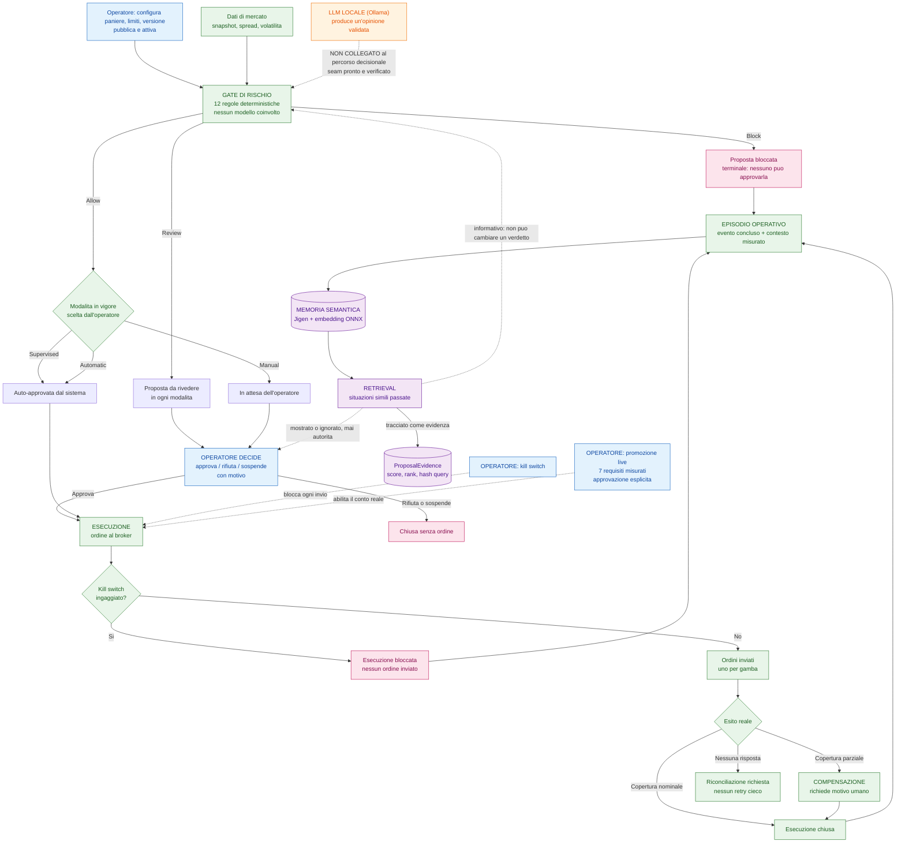

# Mappa dell'automatismo: chi decide, chi esegue, cosa resta umano

Questo documento risponde a tre domande con un solo diagramma: cosa fa il modello, cosa spetta all'operatore,
e quali livelli di automatismo il sistema prevede. E verificato sul codice, non sulle intenzioni: dove una
capacita esiste ma non e ancora collegata, il diagramma lo dice.

## Diagramma di flusso

## Livelli di automatismo

Il routing e deterministico e dipende dalla modalita, scelta dall'operatore. La stessa proposta `Allow` ha tre
esiti diversi secondo la modalita in vigore.

| Modalita | Gate `Allow` | Gate `Review` | Gate `Block` | L'operatore puo decidere a mano? |
| --- | --- | --- | --- | --- |
| `Manual` | In attesa dell'operatore | In attesa dell'operatore | Bloccata | Si |
| `Supervised` | Auto-approvata dal sistema | In attesa dell'operatore | Bloccata | Si |
| `Automatic` | Auto-approvata dal sistema | In attesa dell'operatore | Bloccata | **No**: la delega va revocata prima, tornando a `Manual` o `Supervised` |

Due proprieta che valgono in ogni modalita:

- **`Block` e terminale.** Nessuna modalita e nessuna decisione trasforma una proposta bloccata in eseguibile.
- **`Review` non si automatizza.** Nessuna modalita instrada una revisione verso l'esecuzione: cambia solo chi
  la guarda.

## Autorita: chi puo cosa

| Azione | Chi | Vincolo |
| --- | --- | --- |
| Calcolare il verdetto di rischio | Sistema | 12 regole deterministiche, nessun modello, nessuna memoria |
| Instradare la proposta | Sistema | Funzione pura della modalita e del verdetto |
| Approvare, rifiutare, sospendere | Operatore | Con motivo; mai su una proposta bloccata o scaduta |
| Compensare | Operatore | Motivo obbligatorio; la compensazione e sempre un atto umano |
| Ingaggiare il kill switch | Operatore | Blocca ogni invio, in ogni modalita |
| Rilasciare il kill switch | Operatore | Rifiutato se lo stato del broker non e riconciliato |
| Promuovere al conto reale | Operatore | 7 requisiti misurati, approvazione esplicita; non deducibile dai dati |
| Produrre un'opinione | LLM locale | Opinione validata contro schema e allowlist. Mai un verdetto, una taglia o un'autorizzazione |
| Ricordare un episodio | Sistema | Solo eventi conclusi con esito noto |
| Recuperare situazioni simili | Sistema | Informativo: non entra nel verdetto e non autorizza nulla |

## Cosa il modello non fa, per costruzione

Queste non sono raccomandazioni ma vincoli verificabili nel codice:

- **Il verdetto di rischio non passa dal modello.** `RiskEngine` e una funzione pura senza database e senza LLM:
  riceve valori misurati e soglie, restituisce verdetti. Nessun percorso lo aggira.
- **L'LLM non e collegato al percorso decisionale.** Il seam esiste, e configurato, e il suo output e validato
  campo per campo, ma nessun handler lo chiama per decidere. Oggi l'analisi non dipende dal modello.
- **La memoria non decide.** Il retrieval e eseguito **dopo** che la proposta e stata committata, quindi non puo
  influenzare il verdetto nemmeno volendo: quando la memoria viene consultata, la decisione e gia presa.
- **Un modello fermo non concede autorita.** Se Ollama o la memoria sono indisponibili, l'opinione manca e il
  sistema lo dichiara; non produce un parere di ripiego.

## Stati degradati (dal punto di vista dell'automatismo)

| Condizione | Effetto sul flusso |
| --- | --- |
| Ollama fermo | Nessuna opinione. L'analisi deterministica e il gate restano identici: l'impatto e nullo sul percorso decisionale |
| Memoria ferma | Nessun episodio ricordato e nessun recupero. Il ciclo non si ferma: una memoria che ricorda, non che autorizza |
| Dati di mercato stantii | Il gate blocca: nessuna proposta autorizzabile |
| Broker non riconciliato | Il kill switch non si rilascia; le nuove esecuzioni restano bloccate |
| Conto reale non approvato | Nessun ordine reale: il provider di esecuzione resta quello simulato |
