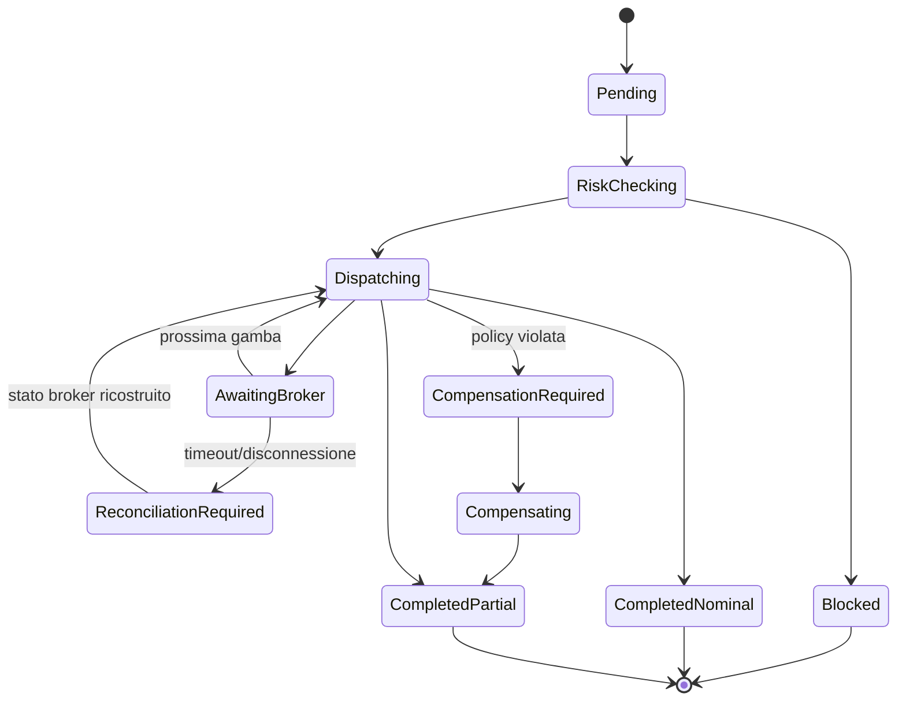

# Analisi funzionale

Status: proposta per Gate 3  
Data: 2026-09-18  
Riferimento UX: `prototipe/` (sola lettura)

## 1. Obiettivo

AutoTrade e un'applicazione headless-first per un singolo operatore che analizza il mercato in modo continuo, genera proposte riferite a versioni immutabili di un paniere, applica regole deterministiche di rischio e invia ordini a un conto cTrader demo. L'LLM puo produrre analisi e spiegazioni, ma non puo autorizzare o inviare ordini.

Il prototipo definisce flussi, terminologia e stati visuali. Non definisce contratti di produzione, formule finanziarie, persistenza o comportamento del broker.

## 2. Attori

| Attore | Responsabilita |
| --- | --- |
| Operatore locale | Configura panieri e policy, decide le eccezioni, controlla esecuzioni, storico e audit |
| Market Manager | Esegue analisi pianificate, valuta proposte e le instrada secondo la modalita operativa |
| Risk Engine | Decide in modo deterministico se una proposta o un'esecuzione e consentita |
| Execution Engine | Converte una proposta autorizzata in gambe e ne governa l'esecuzione sequenziale |
| cTrader | Fornisce dati conto/mercato ed e autorita finale su ordini, deal e posizioni |
| JigenDB | Conserva e recupera evidenze semantiche; non conserva lo stato transazionale |
| Ollama | Produce output strutturati di supporto; non accede al gateway ordini |

Nel MVP esiste un solo ruolo applicativo, `Operator`. Processi automatici e integrazioni sono identita tecniche, non utenti interattivi.

## 3. Scope MVP

- Login locale, sessione e logout dell'operatore.
- Configurazione di un solo conto cTrader demo autorizzato al trading.
- Registro di panieri nominati, clonabili, versionati e archiviabili.
- Esattamente una versione di paniere attiva per le nuove analisi.
- Analisi continua o sospesa e Market Manager manuale, supervisionato o automatico.
- Proposte di entrata, riduzione e uscita con scadenza ed evidenze.
- Gate deterministici di freshness, liquidita, esposizione, margine e perdita giornaliera.
- Esecuzione sequenziale delle gambe per priorita di rischio.
- Gestione di fill, fill parziali, rifiuti, timeout e riconciliazione.
- Kill switch, stato degradato e blocco fail-closed delle nuove aperture.
- Storico Win/Loss separato dal journal cronologico append-only.
- Audit delle azioni dell'operatore e delle decisioni automatiche.

## 4. Fuori scope MVP

- Conti multipli, ruoli multipli e catene di approvazione.
- Trading live: richiede un gate di promozione separato.
- Modifica o importazione del codice da `prototipe/`.
- Backtesting, ottimizzazione di portafoglio e garanzie di redditivita.
- Deployment multi-host, alta disponibilita e failover geografico.
- Mutazioni autonome della composizione del paniere.
- Uso di JigenDB come database transazionale o dell'LLM come autorita di rischio.

## 5. Domini funzionali

### 5.1 Accesso e stato operativo

L'operatore accede con credenziali locali. Tutte le viste di produzione sono protette. La sessione scaduta blocca i comandi e conserva le sole operazioni server gia iniziate. Login, logout, scadenza e comandi sensibili sono auditati.

Lo stato operativo espone almeno:

- connessione cTrader e ultimo heartbeat;
- autorizzazione del conto e scadenza token;
- analisi attiva/sospesa;
- modalita Market Manager;
- kill switch;
- ultimo ciclo di riconciliazione;
- salute di SQLite, JigenDB e Ollama.

### 5.2 Registro e versioni dei panieri

Un paniere ha identita e nome stabili. La bozza corrente e modificabile; una versione pubblicata e immutabile. Pubblicare crea una nuova versione, mentre attivare sceglie quale versione alimenta le nuove analisi.

Operazioni:

- creare, rinominare e clonare un paniere;
- modificare composizione e policy della bozza;
- pubblicare una versione con nota;
- attivare una versione pubblicata dopo un riepilogo di impatto;
- archiviare un paniere non attivo;
- consultare versioni e riferimenti storici.

Regole:

- una sola versione attiva alla volta;
- un paniere attivo non e archiviabile;
- l'archiviazione non cancella versioni, proposte, esecuzioni, episodi o audit;
- i pesi delle gambe incluse devono totalizzare 100% all'attivazione;
- una gamba bloccata o una policy invalida impedisce l'attivazione;
- una proposta conserva sempre l'identificativo della versione che l'ha generata.

### 5.3 Composizione e policy

Ogni gamba definisce simbolo, inclusione, direzione, peso, timeframe e limite di rischio. Score, correlazione, volatilita, spread e stato di eleggibilita sono risultati di analisi e non valori liberamente modificabili.

La policy di versione include almeno rischio massimo del paniere, perdita giornaliera massima, copertura minima e comportamento su esecuzione incompleta:

- `MinimumCoverage`: prosegue solo se la copertura raggiunta rispetta la soglia;
- `AllOrNothing`: avvia compensazione se una gamba non raggiunge l'esito richiesto;
- `RequireConfirmation`: sospende e richiede una decisione esplicita.

Le formule, le soglie e la procedura di compensazione devono essere approvate prima dell'implementazione del Risk Engine.

### 5.4 Analisi continua e Market Manager

Il ciclo di analisi usa solo la versione attiva, dati sufficientemente recenti ed evidenze disponibili. Produce una proposta strutturata con azione, gambe interessate, confidenza informativa, rischio atteso, scadenza, rationale ed evidenze. Un output LLM non valido viene scartato e auditato.

Modalita:

| Modalita | Gate `Pass` | Gate `Review` | Gate `Block` |
| --- | --- | --- | --- |
| Manual | Attesa operatore | Attesa operatore | Vietata |
| Supervised | Avanzamento automatico | Attesa operatore | Vietata |
| Automatic | Avanzamento automatico | Vietata finche non ridefinita come `Pass` | Vietata |

La modalita `Supervised` e predefinita. `Automatic` non aggira mai un gate e, nel conto live, resta disabilitata finche il gate di promozione non la approva esplicitamente.

L'operatore puo approvare, rifiutare o sospendere solo proposte in revisione e non scadute. Ogni decisione richiede una motivazione per rifiuto e sospensione.

### 5.5 Risk Engine

Il Risk Engine e sincrono rispetto all'autorizzazione di una proposta e valuta uno snapshot coerente di versione, mercato, conto, posizioni e perdita giornaliera.

Ogni gate restituisce `Pass`, `Review` o `Block`, codice, misure osservate, soglia applicata e timestamp. Un dato obbligatorio assente o stale produce `Block`; nessun errore tecnico puo degradare automaticamente in permesso.

Gate minimi:

- validita e scadenza della proposta;
- coerenza della versione attiva;
- disponibilita e stato del simbolo;
- spread/liquidita;
- esposizione per gamba, paniere e conto;
- margine atteso e disponibile;
- perdita giornaliera e kill switch;
- autorizzazione demo/live del conto;
- connessione e riconciliazione broker aggiornate.

### 5.6 Esecuzione

Una proposta puo generare una sola esecuzione. L'Execution Engine congela gli input, ordina le gambe secondo una funzione di priorita di rischio approvata e invia una gamba alla volta. La gamba successiva parte solo quando la precedente raggiunge uno stato terminale o la policy autorizza il proseguimento.

Il broker e l'autorita su accettazione, fill, deal e posizione. Un timeout non equivale a rifiuto: porta lo stato a `ReconciliationRequired` e impedisce un nuovo invio finche l'esito non e noto.

Stati dell'esecuzione:

La compensazione non e assunta come rollback atomico: e una nuova sequenza di ordini, soggetta a mercato e audit, e puo lasciare esposizione residua da gestire.

### 5.7 Kill switch e recovery

Il kill switch impedisce nuove analisi operative e nuovi ordini. Non chiude automaticamente posizioni esistenti nel MVP. Ordini e posizioni gia presenti continuano a essere riconciliati e visibili.

Dopo riavvio o riconnessione il sistema:

1. resta fail-closed per nuove esecuzioni;
2. autentica applicazione e conto;
3. acquisisce ordini pendenti e posizioni dal broker;
4. confronta lo stato con SQLite;
5. risolve o segnala ogni divergenza;
6. riabilita l'operativita solo con riconciliazione aggiornata.

### 5.8 Storico e journal

Il Win/Loss History contiene episodi chiusi, PnL netto, R-multiple, durata, MAE, MFE, motivazione di entrata/gestione/uscita ed evidenze collegate. Le metriche aggregate sono calcolate server-side sulla stessa selezione degli episodi.

Il Decision Journal e append-only e registra transizioni, input deterministici, esiti dei gate, decisioni operatore, output LLM accettati/scartati, errori broker e riconciliazioni. Non sostituisce i log tecnici e non e modificabile dalla UI.

## 6. Stati degradati

| Condizione | Comportamento richiesto |
| --- | --- |
| cTrader disconnesso/token invalido | Nuove esecuzioni bloccate; refresh token o nuova autorizzazione; riconciliazione obbligatoria |
| Dati mercato stale | Proposte non autorizzabili; stato e timestamp visibili |
| Ollama non disponibile | Nessuna proposta dipendente dall'LLM; gestione posizioni e audit restano disponibili |
| JigenDB non disponibile | Nessun fallback semantico implicito; proposta sospesa o scartata secondo policy approvata |
| SQLite non scrivibile | Fail-closed; nessun ordine inviato senza registrazione transazionale preventiva |
| Risposta broker incerta | `ReconciliationRequired`; nessun retry cieco |
| Sessione UI scaduta | Comandi rifiutati; processi server gia autorizzati continuano secondo policy |

## 7. Criteri di accettazione

| ID | Criterio osservabile |
| --- | --- |
| AC-01 | Un utente non autenticato non accede alle viste o ai comandi operativi; login/logout/scadenza sono auditati |
| AC-02 | Creazione, rinomina e clone producono identita coerenti senza modificare versioni pubblicate |
| AC-03 | Pubblicazione crea una nuova versione immutabile; attivazione e una transizione separata e confermata |
| AC-04 | In ogni istante esiste al massimo una versione attiva e un paniere attivo non e archiviabile |
| AC-05 | Nessuna proposta e generata senza versione attiva e snapshot di mercato valido |
| AC-06 | Ogni proposta mostra versione, scadenza, gate, rationale ed evidenze ed e decidibile solo negli stati ammessi |
| AC-07 | Manual, Supervised e Automatic rispettano la matrice senza aggirare `Block` o trasformare `Review` in permesso implicito |
| AC-08 | Ogni gate espone codice, valore osservato, soglia e timestamp; dati mancanti bloccano l'operazione |
| AC-09 | Una proposta autorizzata crea al massimo una esecuzione e ogni gamba usa un identificativo client idempotente |
| AC-10 | Le gambe sono inviate sequenzialmente nell'ordine deterministico approvato |
| AC-11 | Timeout o disconnessione non causano reinvio finche la riconciliazione non determina l'esito broker |
| AC-12 | Riavvio con ordini aperti ricostruisce lo stato e mantiene bloccate nuove aperture fino a riconciliazione completata |
| AC-13 | Il kill switch blocca nuove aperture senza fingere di aver chiuso ordini o posizioni esistenti |
| AC-14 | Episodi e metriche Win/Loss derivano da deal riconciliati e restano separati dal journal cronologico |
| AC-15 | Ogni transizione sensibile e ricostruibile dal journal con correlazione tra basket, proposta, esecuzione e broker |
| AC-16 | Arresto di Ollama o JigenDB non concede mai autorita di ordine e produce uno stato degradato esplicito |
| AC-17 | Il conto live e l'operativita automatica live non sono attivabili nel MVP demo |

## 8. Decisioni richieste prima dello sviluppo del Risk Engine

- Soglie numeriche e unita di tutti i gate.
- Timezone e istante di reset della perdita giornaliera.
- Formula di sizing, priorita delle gambe e conversione valutaria.
- Semantica esatta di copertura minima e compensazione.
- Tipi di ordine, time-in-force, slippage e protezioni SL/TP consentite.
- Comportamento quando JigenDB e indisponibile.
- Durata sessione e policy di blocco dopo tentativi login falliti.

## 9. Market Manager - regole funzionali (Slice 6)

Perimetro: instradamento deterministico delle proposte. Nessun LLM, nessuna evidenza semantica e nessun accesso al gateway ordini: arrivano nello Slice 7 e nello Slice 5.

### 9.1 Ciclo di analisi

- Il ciclo usa solo la versione attiva, uno snapshot di mercato entro la finestra di validita e le evidenze disponibili.
- Ogni ciclo produce al massimo una proposta con azione, gambe interessate, confidenza informativa, rischio atteso, scadenza e motivazione.
- Il gate della proposta e la decisione del Risk Engine sullo stesso input: il Market Manager non valuta rischio per conto proprio e non puo migliorare un verdetto.
- Avvio e arresto dell'analisi sono comandi dell'operatore e sono auditati. L'arresto non annulla le proposte gia emesse.

### 9.2 Instradamento

| Modalita | Gate `Pass` | Gate `Review` | Gate `Block` |
| --- | --- | --- | --- |
| Manual | Attesa operatore | Attesa operatore | Bloccata |
| Supervised (default) | Inoltro automatico | Attesa operatore | Bloccata |
| Automatic | Inoltro automatico | Vietata: richiede rivalutazione a `Pass` | Bloccata |

- `Pass` e `Allow` sono lo stesso verdetto: il vocabolario funzionale usa `Pass`, il contratto usa `RiskGateVerdict.Allow`.
- In `Automatic` una proposta `Review` non e decidibile dall'operatore: nessun percorso trasforma una revisione in permesso implicito.
- `Automatic` resta disabilitata sul conto live finche il gate di promozione non la approva (AC-17).

### 9.3 Stati della proposta

`NeedsReview`, `AutoApproved`, `Blocked`, `Approved`, `Rejected`, `Suspended`, `Expired`. Gli stati finali (`Rejected`, `Suspended`, `Expired`) non sono piu decidibili; `Blocked` non e decidibile in nessuna modalita.

### 9.4 Decisioni dell'operatore

- E' decidibile solo una proposta in `NeedsReview`, non scaduta e con la versione ancora attiva.
- Approvazione, rifiuto e sospensione sono comandi distinti; rifiuto e sospensione richiedono una motivazione.
- La decisione rivaluta il gate al momento della decisione: se nel frattempo il verdetto peggiora, la decisione e respinta e la proposta non viene inoltrata.
- La decisione e idempotente: una seconda decisione sulla stessa proposta viene respinta come conflitto.

### 9.5 Scadenza

Ogni proposta nasce con una scadenza. Alla scadenza diventa `Expired`: non e piu decidibile ne inoltrabile. La scadenza e valutata sia alla lettura sia alla decisione, e il passaggio a `Expired` viene registrato nel journal.

### 9.6 Audit

Generazione, inoltro automatico, decisione, rifiuto, sospensione, scadenza, cambio modalita e avvio/arresto dell'analisi producono un evento di journal correlato a paniere, versione e proposta.
