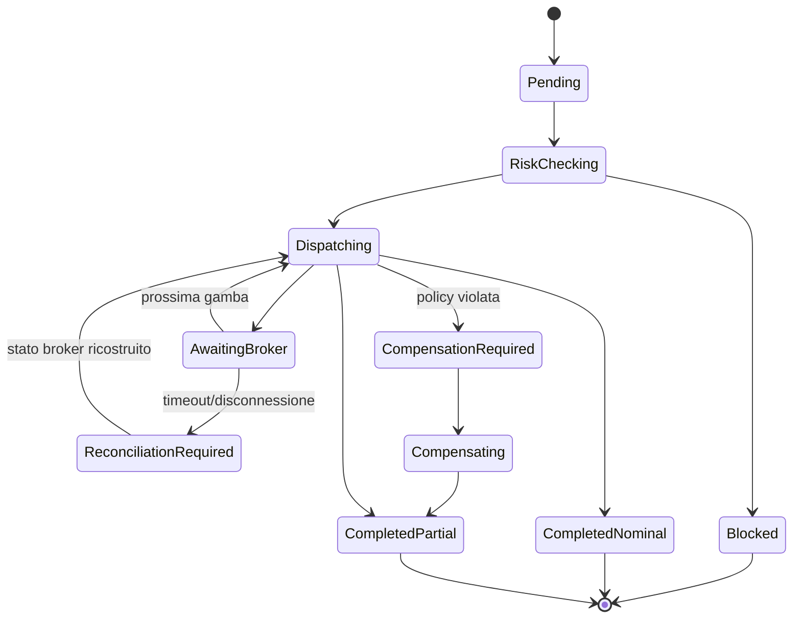

# Analisi funzionale

Status: proposta per Gate 3  
Data: 2026-09-18  
Riferimento UX: `prototipe/` (sola lettura)

## 1. Obiettivo

AutoTrade e un'applicazione headless-first per un singolo operatore che analizza il mercato in modo continuo, genera proposte riferite a versioni immutabili di un paniere, applica regole deterministiche di rischio e invia ordini a un conto cTrader demo. L'LLM puo produrre analisi e spiegazioni, ma non puo autorizzare o inviare ordini.

Il prototipo definisce flussi, terminologia e stati visuali. Non definisce contratti di produzione, formule finanziarie, persistenza o comportamento del broker.

## 2. Attori

| Attore | Responsabilita |
| --- | --- |
| Operatore locale | Configura panieri e policy, decide le eccezioni, controlla esecuzioni, storico e audit |
| Market Manager | Esegue analisi pianificate, valuta proposte e le instrada secondo la modalita operativa |
| Risk Engine | Decide in modo deterministico se una proposta o un'esecuzione e consentita |
| Execution Engine | Converte una proposta autorizzata in gambe e ne governa l'esecuzione sequenziale |
| cTrader | Fornisce dati conto/mercato ed e autorita finale su ordini, deal e posizioni |
| JigenDB | Conserva e recupera evidenze semantiche; non conserva lo stato transazionale |
| Ollama | Produce output strutturati di supporto; non accede al gateway ordini |

Nel MVP esiste un solo ruolo applicativo, `Operator`. Processi automatici e integrazioni sono identita tecniche, non utenti interattivi.

## 3. Scope MVP

- Login locale, sessione e logout dell'operatore.
- Configurazione di un solo conto cTrader demo autorizzato al trading.
- Registro di panieri nominati, clonabili, versionati e archiviabili.
- Esattamente una versione di paniere attiva per le nuove analisi.
- Analisi continua o sospesa e Market Manager manuale, supervisionato o automatico.
- Strategia versionata del paniere: modalita di ingresso dichiarata e limiti di rischio, congelati nella versione.
- Proposte di entrata, riduzione e uscita con scadenza ed evidenze.
- Gate deterministici di freshness, liquidita, esposizione, margine e perdita giornaliera.
- Esecuzione sequenziale delle gambe per priorita di rischio.
- Gestione di fill, fill parziali, rifiuti, timeout e riconciliazione.
- Kill switch, stato degradato e blocco fail-closed delle nuove aperture.
- Storico Win/Loss separato dal journal cronologico append-only.
- Audit delle azioni dell'operatore e delle decisioni automatiche.

## 4. Fuori scope MVP

- Conti multipli, ruoli multipli e catene di approvazione.
- Trading live: richiede un gate di promozione separato.
- Modifica o importazione del codice da `prototipe/`.
- Backtesting, ottimizzazione di portafoglio e garanzie di redditivita.
- Deployment multi-host, alta disponibilita e failover geografico.
- Mutazioni autonome della composizione del paniere.
- Uso di JigenDB come database transazionale o dell'LLM come autorita di rischio.

## 5. Domini funzionali

### 5.1 Accesso e stato operativo

L'operatore accede con credenziali locali. Tutte le viste di produzione sono protette. La sessione scaduta blocca i comandi e conserva le sole operazioni server gia iniziate. Login, logout, scadenza e comandi sensibili sono auditati.

Lo stato operativo espone almeno:

- connessione cTrader e ultimo heartbeat;
- autorizzazione del conto e scadenza token;
- analisi attiva/sospesa;
- modalita Market Manager;
- kill switch;
- ultimo ciclo di riconciliazione;
- salute di SQLite, JigenDB e Ollama.

### 5.2 Registro e versioni dei panieri

Un paniere ha identita e nome stabili. La bozza corrente e modificabile; una versione pubblicata e immutabile. Pubblicare crea una nuova versione, mentre attivare sceglie quale versione alimenta le nuove analisi.

Operazioni:

- creare, rinominare e clonare un paniere;
- modificare composizione e policy della bozza;
- pubblicare una versione con nota;
- attivare una versione pubblicata dopo un riepilogo di impatto;
- archiviare un paniere non attivo;
- consultare versioni e riferimenti storici.

Regole:

- una sola versione attiva alla volta;
- un paniere attivo non e archiviabile;
- l'archiviazione non cancella versioni, proposte, esecuzioni, episodi o audit;
- i pesi delle gambe incluse devono totalizzare 100% all'attivazione;
- una gamba bloccata o una policy invalida impedisce l'attivazione;
- una proposta conserva sempre l'identificativo della versione che l'ha generata.

### 5.3 Composizione e policy

Ogni gamba definisce simbolo, inclusione, direzione, peso, timeframe e limite di rischio. Score, correlazione, volatilita, spread e stato di eleggibilita sono risultati di analisi e non valori liberamente modificabili.

La policy di versione include almeno rischio massimo del paniere, perdita giornaliera massima, copertura minima e comportamento su esecuzione incompleta:

- `MinimumCoverage`: prosegue solo se la copertura raggiunta rispetta la soglia;
- `AllOrNothing`: avvia compensazione se una gamba non raggiunge l'esito richiesto;
- `RequireConfirmation`: sospende e richiede una decisione esplicita.

Le formule, le soglie e la procedura di compensazione devono essere approvate prima dell'implementazione del Risk Engine.

### 5.4 Analisi continua e Market Manager

Il ciclo di analisi usa solo la versione attiva, dati sufficientemente recenti ed evidenze disponibili. Produce una proposta strutturata con azione, gambe interessate, confidenza informativa, rischio atteso, scadenza, rationale ed evidenze. Un output LLM non valido viene scartato e auditato.

Modalita:

| Modalita | Gate `Pass` | Gate `Review` | Gate `Block` |
| --- | --- | --- | --- |
| Manual | Attesa operatore | Attesa operatore | Vietata |
| Supervised | Avanzamento automatico | Attesa operatore | Vietata |
| Automatic | Avanzamento automatico | Vietata finche non ridefinita come `Pass` | Vietata |

La modalita `Supervised` e predefinita. `Automatic` non aggira mai un gate e, nel conto live, resta disabilitata finche il gate di promozione non la approva esplicitamente.

L'operatore puo approvare, rifiutare o sospendere solo proposte in revisione e non scadute. Ogni decisione richiede una motivazione per rifiuto e sospensione.

### 5.5 Risk Engine

Il Risk Engine e sincrono rispetto all'autorizzazione di una proposta e valuta uno snapshot coerente di versione, mercato, conto, posizioni e perdita giornaliera.

Ogni gate restituisce `Pass`, `Review` o `Block`, codice, misure osservate, soglia applicata e timestamp. Un dato obbligatorio assente o stale produce `Block`; nessun errore tecnico puo degradare automaticamente in permesso.

Gate minimi:

- validita e scadenza della proposta;
- coerenza della versione attiva;
- disponibilita e stato del simbolo;
- spread/liquidita;
- esposizione per gamba, paniere e conto;
- margine atteso e disponibile;
- perdita giornaliera e kill switch;
- autorizzazione demo/live del conto;
- connessione e riconciliazione broker aggiornate.

### 5.6 Esecuzione

Una proposta puo generare una sola esecuzione. L'Execution Engine congela gli input, ordina le gambe secondo una funzione di priorita di rischio approvata e invia una gamba alla volta. La gamba successiva parte solo quando la precedente raggiunge uno stato terminale o la policy autorizza il proseguimento.

Il broker e l'autorita su accettazione, fill, deal e posizione. Un timeout non equivale a rifiuto: porta lo stato a `ReconciliationRequired` e impedisce un nuovo invio finche l'esito non e noto.

Stati dell'esecuzione:

La compensazione non e assunta come rollback atomico: e una nuova sequenza di ordini, soggetta a mercato e audit, e puo lasciare esposizione residua da gestire.

### 5.7 Kill switch e recovery

Il kill switch impedisce nuove analisi operative e nuovi ordini. Non chiude automaticamente posizioni esistenti nel MVP. Ordini e posizioni gia presenti continuano a essere riconciliati e visibili.

Dopo riavvio o riconnessione il sistema:

1. resta fail-closed per nuove esecuzioni;
2. autentica applicazione e conto;
3. acquisisce ordini pendenti e posizioni dal broker;
4. confronta lo stato con SQLite;
5. risolve o segnala ogni divergenza;
6. riabilita l'operativita solo con riconciliazione aggiornata.

### 5.8 Storico e journal

Il Win/Loss History contiene episodi chiusi, PnL netto, R-multiple, durata, MAE, MFE, motivazione di entrata/gestione/uscita ed evidenze collegate. Le metriche aggregate sono calcolate server-side sulla stessa selezione degli episodi.

Il Decision Journal e append-only e registra transizioni, input deterministici, esiti dei gate, decisioni operatore, output LLM accettati/scartati, errori broker e riconciliazioni. Non sostituisce i log tecnici e non e modificabile dalla UI.

## 6. Stati degradati

| Condizione | Comportamento richiesto |
| --- | --- |
| cTrader disconnesso/token invalido | Nuove esecuzioni bloccate; refresh token o nuova autorizzazione; riconciliazione obbligatoria |
| Dati mercato stale | Proposte non autorizzabili; stato e timestamp visibili |
| Ollama non disponibile | Nessuna proposta dipendente dall'LLM; gestione posizioni e audit restano disponibili |
| JigenDB non disponibile | Nessun fallback semantico implicito; proposta sospesa o scartata secondo policy approvata |
| SQLite non scrivibile | Fail-closed; nessun ordine inviato senza registrazione transazionale preventiva |
| Risposta broker incerta | `ReconciliationRequired`; nessun retry cieco |
| Sessione UI scaduta | Comandi rifiutati; processi server gia autorizzati continuano secondo policy |

## 7. Criteri di accettazione

| ID | Criterio osservabile |
| --- | --- |
| AC-01 | Un utente non autenticato non accede alle viste o ai comandi operativi; login/logout/scadenza sono auditati |
| AC-02 | Creazione, rinomina e clone producono identita coerenti senza modificare versioni pubblicate |
| AC-03 | Pubblicazione crea una nuova versione immutabile; attivazione e una transizione separata e confermata |
| AC-04 | In ogni istante esiste al massimo una versione attiva e un paniere attivo non e archiviabile |
| AC-05 | Nessuna proposta e generata senza versione attiva e snapshot di mercato valido |
| AC-06 | Ogni proposta mostra versione, scadenza, gate, rationale ed evidenze ed e decidibile solo negli stati ammessi |
| AC-07 | Manual, Supervised e Automatic rispettano la matrice senza aggirare `Block` o trasformare `Review` in permesso implicito |
| AC-08 | Ogni gate espone codice, valore osservato, soglia e timestamp; dati mancanti bloccano l'operazione |
| AC-09 | Una proposta autorizzata crea al massimo una esecuzione e ogni gamba usa un identificativo client idempotente |
| AC-10 | Le gambe sono inviate sequenzialmente nell'ordine deterministico approvato |
| AC-11 | Timeout o disconnessione non causano reinvio finche la riconciliazione non determina l'esito broker |
| AC-12 | Riavvio con ordini aperti ricostruisce lo stato e mantiene bloccate nuove aperture fino a riconciliazione completata |
| AC-13 | Il kill switch blocca nuove aperture senza fingere di aver chiuso ordini o posizioni esistenti |
| AC-14 | Episodi e metriche Win/Loss derivano da deal riconciliati e restano separati dal journal cronologico |
| AC-15 | Ogni transizione sensibile e ricostruibile dal journal con correlazione tra basket, proposta, esecuzione e broker |
| AC-16 | Arresto di Ollama o JigenDB non concede mai autorita di ordine e produce uno stato degradato esplicito |
| AC-17 | Il conto live e l'operativita automatica live non sono attivabili nel MVP demo |
| AC-18 | Le regole della strategia sono versionate: una modifica della bozza non cambia la versione in vigore, e la proposta riporta la modalita dichiarata della versione da cui nasce |

## 8. Decisioni richieste prima dello sviluppo del Risk Engine

- Soglie numeriche e unita di tutti i gate.
- Timezone e istante di reset della perdita giornaliera.
- Formula di sizing, priorita delle gambe e conversione valutaria.
- Semantica esatta di copertura minima e compensazione.
- Tipi di ordine, time-in-force, slippage e protezioni SL/TP consentite.
- Comportamento quando JigenDB e indisponibile.
- Durata sessione e policy di blocco dopo tentativi login falliti.

## 9. Market Manager - regole funzionali (Slice 6)

Perimetro: instradamento deterministico delle proposte. Nessun LLM, nessuna evidenza semantica e nessun accesso al gateway ordini: arrivano nello Slice 7 e nello Slice 5.

### 9.1 Ciclo di analisi

- Il ciclo usa solo la versione attiva, uno snapshot di mercato entro la finestra di validita e le evidenze disponibili.
- Ogni ciclo produce al massimo una proposta con azione, gambe interessate, confidenza informativa, rischio atteso, scadenza e motivazione.
- Il gate della proposta e la decisione del Risk Engine sullo stesso input: il Market Manager non valuta rischio per conto proprio e non puo migliorare un verdetto.
- Avvio e arresto dell'analisi sono comandi dell'operatore e sono auditati. L'arresto non annulla le proposte gia emesse.

### 9.2 Instradamento

| Modalita | Gate `Pass` | Gate `Review` | Gate `Block` |
| --- | --- | --- | --- |
| Manual | Attesa operatore | Attesa operatore | Bloccata |
| Supervised (default) | Inoltro automatico | Attesa operatore | Bloccata |
| Automatic | Inoltro automatico | Vietata: richiede rivalutazione a `Pass` | Bloccata |

- `Pass` e `Allow` sono lo stesso verdetto: il vocabolario funzionale usa `Pass`, il contratto usa `RiskGateVerdict.Allow`.
- In `Automatic` una proposta `Review` non e decidibile dall'operatore: nessun percorso trasforma una revisione in permesso implicito.
- `Automatic` resta disabilitata sul conto live finche il gate di promozione non la approva (AC-17).

### 9.3 Stati della proposta

`NeedsReview`, `AutoApproved`, `Blocked`, `Approved`, `Rejected`, `Suspended`, `Expired`. Gli stati finali (`Rejected`, `Suspended`, `Expired`) non sono piu decidibili; `Blocked` non e decidibile in nessuna modalita.

### 9.4 Decisioni dell'operatore

- E' decidibile solo una proposta in `NeedsReview`, non scaduta e con la versione ancora attiva.
- Approvazione, rifiuto e sospensione sono comandi distinti; rifiuto e sospensione richiedono una motivazione.
- La decisione rivaluta il gate al momento della decisione: se nel frattempo il verdetto peggiora, la decisione e respinta e la proposta non viene inoltrata.
- La decisione e idempotente: una seconda decisione sulla stessa proposta viene respinta come conflitto.

### 9.5 Scadenza

Ogni proposta nasce con una scadenza. Alla scadenza diventa `Expired`: non e piu decidibile ne inoltrabile. La scadenza e valutata sia alla lettura sia alla decisione, e il passaggio a `Expired` viene registrato nel journal.

### 9.6 Audit

Generazione, inoltro automatico, decisione, rifiuto, sospensione, scadenza, cambio modalita e avvio/arresto dell'analisi producono un evento di journal correlato a paniere, versione e proposta.

## 10. Execution Engine - regole funzionali (Slice 5)

Perimetro: trasformare una proposta autorizzata in una sequenza di ordini governata, con persistenza prima dell'invio. L'esecuzione non decide rischio e non puo migliorare un verdetto.

### 10.1 Una proposta, una esecuzione

- Una proposta puo generare **al massimo una esecuzione** (AC-09). Un secondo tentativo sulla stessa proposta viene respinto come conflitto.
- L'esecuzione congela gli input al momento della creazione: versione, gambe, ordine delle gambe, volumi, policy e lo snapshot di mercato su cui e stata decisa.
- L'esecuzione nasce **prima** dell'invio: prima viene persistita, poi si parla con il broker. Un riavvio in mezzo non perde nulla e non duplica (AC-12).

### 10.2 Ordine delle gambe e invio sequenziale

- Le gambe sono inviate **una alla volta** nell'ordine deterministico approvato: per risk cap decrescente, a parita di risk cap per simbolo (AC-10).
- La gamba successiva parte solo quando la precedente raggiunge uno stato terminale, oppure quando la policy autorizza il proseguimento (copertura minima raggiunta).
- Ogni gamba porta un `clientOrderId` idempotente, generato e persistito prima dell'invio: un reinvio con lo stesso identificativo non puo produrre un secondo ordine (AC-09).

### 10.3 Esito broker, timeout e riconciliazione

- Il broker e l'autorita su accettazione, fill, deal e posizione.
- Un **timeout o una disconnessione non equivalgono a un rifiuto**: portano la gamba e l'esecuzione a `ReconciliationRequired` e bloccano ogni nuovo invio finche l'esito non e noto (AC-11).
- Nessun reinvio automatico senza riconciliazione: e il divieto di retry cieco.

### 10.4 Fill parziali e policy

- Un fill parziale e un esito reale, non un errore: la copertura e la somma dei volumi effettivamente riempiti sulle gambe previste.
- La policy della versione decide cosa succede sotto copertura piena: `MinimumCoverage` prosegue finche la copertura richiesta e raggiunta, `AllOrNothing` richiede il 100%, `RequireConfirmation` sospende e chiede una decisione esplicita.
- Una policy violata porta l'esecuzione a `CompensationRequired`; non produce mai una chiusura silenziosa.

### 10.5 Compensazione esplicita

- La compensazione **non e un rollback atomico**: e una nuova sequenza di ordini, soggetta a mercato e a audit, e puo lasciare esposizione residua.
- La compensazione la conferma l'operatore, sempre, anche in modalita Automatica: tocca posizioni reali e non e una decisione delegabile.
- Se la compensazione non e confermata, l'esposizione residua resta visibile e l'esecuzione resta in `CompensationRequired`.

### 10.6 Kill switch e riavvio

- Il kill switch blocca nuove esecuzioni e nuovi invii. Non chiude posizioni esistenti e non annulla un'esecuzione gia in corso.
- Dopo un riavvio il sistema resta fail-closed per le nuove esecuzioni finche la riconciliazione non e aggiornata; le esecuzioni incomplete restano visibili con il loro stato reale.

### 10.7 Simboli, volume e gate di sicurezza

- I simboli negoziabili sono **quelli che il provider fornisce**: l'applicazione non mantiene un elenco proprio di simboli consentiti, e non puo inventare strumenti che il provider non descrive.
- L'**ordine minimo, il passo e il massimo** sono proprieta dello strumento, non decisioni operative: arrivano dalla descrizione del simbolo del provider e cambiano da simbolo a simbolo (leva, lotto, taglia contrattuale). Per questo l'esecuzione non li configura e non li assume.
- Il **volume** di ogni gamba e deciso dal **modello di rischio**: nasce da capitale, risk cap della gamba e distanza di stop, viene arrotondato per difetto al passo dello strumento e viene **rifiutato** se scende sotto il minimo del provider. Non viene mai alzato d'ufficio per "far entrare" un ordine.
- Un simbolo che il provider non descrive come negoziabile, o per cui manca la taglia necessaria al calcolo, non viene inviato: l'esecuzione si ferma con il motivo esplicito invece di indovinare.
- La conversione valutaria e richiesta quando ne la valuta base ne quella di quotazione coincidono con la valuta del conto: senza un tasso fornito dal provider il calcolo non produce un volume e l'invio non avviene.

## 11. Strategia - regole funzionali (Slice 9)

Perimetro: le regole che trasformano l'analisi in una proposta. La strategia **non e una entita separata**: e la policy della versione di paniere, perche gli stessi due limiti (rischio per paniere e perdita giornaliera) governano gia il gate di rischio. Una seconda copia permetterebbe alla schermata e al gate di dichiarare limiti diversi.

### 11.1 Regole versionate

- Le regole della strategia sono la **modalita di ingresso dichiarata**, il **rischio per paniere**, la **perdita giornaliera massima**, la **copertura minima** e il **comportamento a esecuzione incompleta**.
- Le regole si modificano sulla **bozza** e diventano effettive solo con la pubblicazione di una versione: la versione in vigore non cambia quando cambia la bozza, e la schermata tiene le due cose distinte.
- Ogni versione congela le proprie regole. La proposta riporta la modalita dichiarata della versione da cui nasce, quindi una decisione resta leggibile insieme alla strategia che l'ha prodotta anche dopo che il paniere e avanzato.
- Una modalita non riconosciuta dal vocabolario viene rifiutata: una proposta deve poter dire sempre quale regola la governava.

### 11.2 Cosa la modalita dichiara e cosa no

- La modalita di ingresso e una **dichiarazione versionata**: viene registrata con la versione, riportata su ogni proposta e auditata come ogni altra proprieta della versione.
- La regola direzionale che ne deriva richiede una **serie storica** (momentum, regime): la sorgente deterministica osserva un singolo snapshot e quindi non la esercita. Finche la sorgente di evidenze non esiste, il verdetto resta quello del gate di rischio e la modalita non lo modifica. La schermata lo dichiara invece di lasciar credere che il selettore cambi le proposte.
- Nessun esito dipende dalla modalita: `Block` resta terminale in ogni modalita e nessuna modalita trasforma una revisione in permesso.

### 11.3 Guardrail

- Il modello locale puo proporre parametri, ma **non puo modificare questi limiti ne inviare ordini**: il gate di rischio deterministico resta l'unica autorita.
- La strategia non bypassa visivamente la decisione di rischio: la schermata delle regole non mostra un verdetto proprio, e il verdetto continua ad arrivare dal Risk Engine.

### 11.4 Gate di promozione live

- Il conto live e l'operativita automatica live **non sono attivabili nel MVP demo** (AC-17).
- Il gate di promozione e composto dai requisiti registrati in `ImplementationRoadmap.md` e la sua lettura e **read-only**: non esiste un comando che apra il gate.
- Ogni requisito riporta uno stato misurato: `Soddisfatto`, `Non soddisfatto` oppure `Non verificabile dal sistema`. Un requisito che richiede un'approvazione, un drill o una revisione non viene mai marcato soddisfatto per il fatto che nulla lo contraddice.
- Un archivio di esecuzioni vuoto non vale come periodo pulito: il requisito sulle divergenze richiede almeno una esecuzione conclusa.
