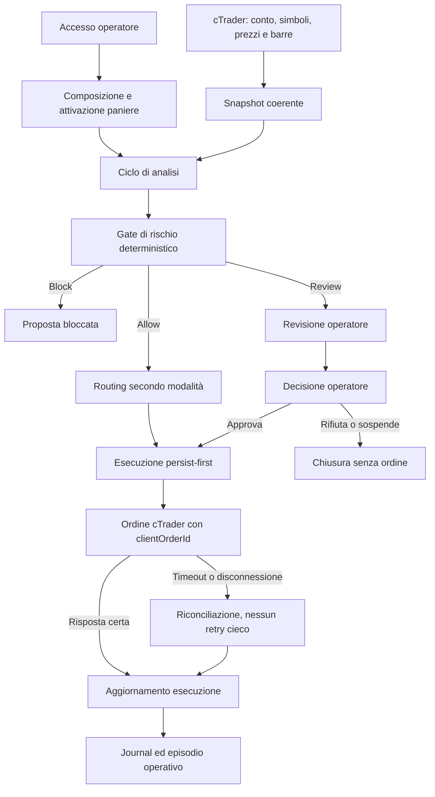

# Come funziona AutoTrade

Questa guida descrive AutoTrade dal punto di vista dell'operatore e del funzionamento reale del sistema. Non serve conoscere il codice per seguirla.

AutoTrade osserva il mercato, valuta un paniere attraverso regole di rischio deterministiche, crea proposte e, quando tutte le condizioni lo consentono, invia gli ordini a cTrader. Le decisioni pericolose restano vincolate da limiti espliciti, dal kill switch e dallo stato di riconciliazione del broker.

## 1. Il principio fondamentale

Il sistema separa tre responsabilità:

1. **Il broker fornisce i fatti:** prezzi, strumenti disponibili, limiti di volume, saldo, posizioni, ordini e deal.
2. **Il motore di rischio decide se un'operazione è ammissibile:** usa esclusivamente misure e soglie deterministiche.
3. **L'operatore decide la politica:** compone il paniere, sceglie i limiti, attiva una versione, seleziona la modalità operativa e mantiene l'autorità sul kill switch e sulle compensazioni.

Il modello locale e la memoria semantica possono aggiungere contesto, ma non possono autorizzare un ordine, cambiare una soglia o determinare il volume.

## 2. Il flusso completo



### In parole semplici

- L'operatore configura un paniere e ne pubblica una versione immutabile.
- Il sistema acquisisce uno snapshot del mercato e del conto.
- Il Risk Engine confronta lo snapshot con i limiti della versione attiva.
- Una proposta viene bloccata, inviata a revisione oppure ammessa.
- La modalità operativa stabilisce se una proposta ammessa attende l'operatore o prosegue automaticamente.
- Prima di parlare con cTrader, l'intenzione di inviare ogni gamba viene registrata nel database.
- Ogni ordine ha un `clientOrderId` deterministico, usato per riconoscerlo dopo timeout, restart o reconnect.
- Se l'esito non è certo, il sistema non ripete l'ordine: entra in riconciliazione.

## 3. Modalità disponibili

### Simulata

Prezzi ed esiti degli ordini sono prodotti da simulatori deterministici. Serve per sviluppare, mostrare i flussi e forzare casi come rifiuti, fill parziali e timeout. Non contatta cTrader.

### Demo cTrader

Usa un conto demo reale cTrader. Prezzi, strumenti, saldo, posizioni, ordini e deal arrivano dal provider. Gli ordini hanno effetto esclusivamente sul conto demo.

Questa è la prima modalità operativa da collaudare.

### Live

È disabilitata per impostazione predefinita. Richiede una promozione esplicita, la configurazione `AllowLive=true` e la chiusura dei sette requisiti del gate live. L'approvazione dell'applicazione cTrader, da sola, non abilita il live.

## 4. Collegamento a cTrader

### OAuth e token

Le credenziali dell'applicazione restano sul server. Il browser viene inviato alla pagina di consenso cTrader e il callback scambia il codice temporaneo con access token e refresh token.

I token:

- non vengono mai inviati al client Vue;
- sono cifrati nel database;
- vengono ruotati prima della scadenza;
- sono aggiornati atomicamente, perché un refresh invalida la coppia precedente;
- non devono comparire nei log o nel journal.

### Connessione Protobuf

AutoTrade usa lo schema Protobuf ufficiale cTrader attraverso un proprio client WebSocket. Non dipende dal vecchio SDK .NET del provider.

Il runtime gestisce:

- correlazione richiesta/risposta;
- un solo writer WebSocket alla volta;
- heartbeat;
- reconnect con backoff limitato;
- ri-autenticazione applicazione e conto;
- ripristino delle sottoscrizioni;
- stato fail-closed quando la connessione non è affidabile.

Un ordine non viene mai reinviato automaticamente dal trasporto.

## 5. Dati di mercato e volatilità

Per ogni cattura cTrader il sistema legge:

- saldo e valuta del conto;
- PnL realizzato e non realizzato;
- catalogo e caratteristiche degli strumenti;
- bid, ask e spread;
- posizioni e ordini pendenti;
- trendbar M15.

La volatilità non è inventata né letta da una configurazione. È calcolata sulle ultime 96 barre M15 chiuse usando rendimenti logaritmici, deviazione standard campionaria e annualizzazione.

La cattura viene rifiutata se le barre sono insufficienti, duplicate, future, stantie, malformate o contengono prezzi non validi. In quel caso il gate blocca invece di sostituire un valore.

## 6. Paniere e versioni

Un paniere contiene una o più gambe. Ogni gamba definisce almeno:

- simbolo e mercato;
- direzione;
- peso;
- rischio massimo;
- distanza dello stop;
- spread massimo;
- volatilità massima.

La bozza può essere modificata. Quando viene pubblicata nasce una versione immutabile. L'attivazione sceglie quale versione governa le future analisi; non modifica le proposte o le esecuzioni già create.

Questa separazione consente di ricostruire esattamente quali limiti erano in vigore quando una decisione è stata presa.

## 7. Risk Engine

Il Risk Engine è deterministico: con gli stessi input produce sempre lo stesso risultato. Controlla, tra le altre cose:

- presenza e freschezza dello snapshot;
- kill switch;
- disponibilità e negoziabilità degli strumenti;
- spread e volatilità per gamba;
- copertura eseguibile;
- rischio complessivo del paniere;
- perdita giornaliera;
- disponibilità dei dati necessari al position sizing.

Ogni gate restituisce:

- `Allow`, `Review` oppure `Block`;
- un codice stabile;
- valore osservato;
- soglia applicata;
- unità di misura;
- timestamp e spiegazione.

Un dato obbligatorio assente non equivale a zero e non equivale a sicuro: produce un blocco.

## 8. Routing delle proposte

| Modalità | `Allow` | `Review` | `Block` |
| --- | --- | --- | --- |
| Manual | Attende l'operatore | Attende l'operatore | Terminale |
| Supervised | Prosegue automaticamente | Attende l'operatore | Terminale |
| Automatic | Prosegue automaticamente | Attende, ma non è decidibile finché non si cambia modalità | Terminale |

`Block` non può essere scavalcato. Prima di un'approvazione manuale il rischio viene rivalutato con dati freschi; se nel frattempo è peggiorato, l'ordine non parte.

## 9. Esecuzione degli ordini

L'esecuzione segue il principio **persist-first**:

1. vengono salvate l'esecuzione e le gambe;
2. ogni gamba riceve un `clientOrderId` univoco e deterministico;
3. solo dopo il commit viene chiamato il gateway;
4. le gambe vengono inviate nella sequenza stabilita dalla priorità di rischio;
5. ogni evento broker viene registrato una volta sola.

Un timeout significa “esito sconosciuto”, non “ordine rifiutato”. Il sistema passa a `ReconciliationRequired` e non crea una seconda esposizione provando di nuovo.

### Fill parziale e compensazione

Una compensazione non è un rollback. È una nuova sequenza di ordini, con nuovi identificativi e un nuovo audit trail. Richiede sempre conferma e motivazione dell'operatore, anche in modalità automatica.

## 10. Riconciliazione e riavvio

Il worker di riconciliazione interroga periodicamente gli ordini non terminali. Per ogni gamba:

- cerca l'ordine tramite `clientOrderId` e simbolo;
- rifiuta risultati mancanti, troncati o ambigui;
- legge i dettagli e i deal;
- deduplica gli eventi tramite identità broker;
- aggiorna gamba, esecuzione e watermark del conto in una sola unità di lavoro.

Il worker non invia ordini e non esegue retry. Finché esiste una divergenza irrisolta, il conto resta in stato di riconciliazione e le nuove aperture rimangono bloccate.

Con il provider di esecuzione cTrader il server rifiuta di avviarsi se il worker non è abilitato o se l'intervallo non è positivo.

## 11. Kill switch

Il kill switch impedisce nuove aperture in qualsiasi modalità. Non chiude automaticamente posizioni già aperte e non finge che un'esposizione sia sparita.

Il rilascio viene rifiutato se il broker non è connesso e riconciliato di recente. Ingaggio e rilascio sono registrati nel journal.

## 12. LLM e memoria semantica

### Ollama

Ollama esegue un modello locale e produce soltanto un'opinione strutturata. La risposta viene validata campo per campo. Un simbolo estraneo, un valore fuori vocabolario o una risposta troppo grande vengono rifiutati.

L'LLM non calcola il rischio, non decide il volume e non raggiunge il gateway ordini.

### Jigen e embedding ONNX

Gli eventi operativi conclusi possono essere trasformati in episodi e salvati nella memoria semantica. Gli embedding sono prodotti in-process tramite ONNX. Il retrieval trova situazioni passate simili e le presenta come evidenza informativa.

La memoria non contiene lo stato transazionale e non può cambiare un verdetto già prodotto.

## 13. Configurazione sicura per il demo

I segreti devono stare in `appsettings.Local.json`, in variabili d'ambiente o in un secret store; non devono essere committati.

Configurazione concettuale per il collaudo demo:

```json
{
  "Trading": {
    "Broker": {
      "Environment": "Demo",
      "Scope": "trading"
    },
    "MarketData": {
      "Provider": "Ctrader"
    },
    "Execution": {
      "Provider": "Ctrader",
      "Ctrader": {
        "AllowLive": false
      },
      "Reconciliation": {
        "Enabled": true,
        "IntervalSeconds": 30
      }
    }
  }
}
```

Prima si prova il percorso read-only lasciando `Execution.Provider` a `None`. L'esecuzione cTrader si abilita soltanto dopo avere verificato OAuth, snapshot, trendbar, scale di prezzo e volume e reconnect.

## 14. Sequenza consigliata per le prime prove

### Prova 1: avvio locale

- avviare le dipendenze configurate, incluso Ollama se il provider è attivo;
- avviare il server;
- verificare `/health`;
- accedere con l'operatore locale.

### Prova 2: autorizzazione cTrader

- avviare il consenso OAuth dall'applicazione;
- autorizzare un solo conto demo;
- verificare lo stato connessione;
- richiedere `/api/broker/snapshot`.

Nello snapshot controllare valuta, saldo, simboli, min/step/max volume, posizioni e ordini pendenti.

### Prova 3: feed reale senza ordini

- impostare `MarketData.Provider=Ctrader`;
- lasciare `Execution.Provider=None`;
- verificare spread, trendbar e volatilità;
- controllare che dati mancanti o stantii producano un blocco.

### Prova 4: ordine minimo demo

- concordare simbolo e volume minimo;
- attivare una versione di paniere con limiti espliciti;
- mantenere `AllowLive=false`;
- abilitare gateway e worker di riconciliazione;
- iniziare in modalità `Manual` o `Supervised`;
- rilasciare il kill switch solo dopo una riconciliazione pulita;
- inviare una sola esecuzione demo controllata.

### Prova 5: recovery

- riavviare il server con un ordine aperto;
- interrompere temporaneamente la connessione;
- verificare che non venga inviato un duplicato;
- verificare che lo stato venga ricostruito;
- esercitare kill switch e compensazione.

## 15. Stati degradati

| Condizione | Comportamento |
| --- | --- |
| cTrader non raggiungibile | Snapshot indisponibile; niente nuove aperture |
| Token non valido | Refresh o nuova autorizzazione; nessun fallback permissivo |
| Barre insufficienti | Volatilità assente e gate bloccante |
| Timeout dopo l'invio | Riconciliazione; nessun retry cieco |
| Ordine ambiguo | Stato `ReconciliationRequired` |
| Ollama non disponibile | Se configurato, il server rifiuta l'avvio |
| Memoria non disponibile | Nessuna evidenza semantica; non viene inventato contenuto |
| Kill switch inserito | Nuove aperture bloccate |

## 16. Cosa manca prima del live

Il live richiede tutti questi requisiti:

- periodo demo e criteri quantitativi approvati;
- zero divergenze irrisolte;
- recovery drill e restore test superati;
- limiti, simboli, volumi e modalità live approvati;
- revisione della sicurezza e dei segreti;
- rollback a demo e kill switch provati;
- ADR dedicato e approvazione esplicita.

Il gate è consultabile ma non può essere aperto automaticamente dall'applicazione: le approvazioni umane non vengono dedotte dall'assenza di errori.

## 17. Dove osservare il sistema

- **Stato operativo:** connessione, kill switch e dipendenze.
- **Panieri:** composizione, policy, pubblicazione e attivazione.
- **Strategia:** regole dichiarate e percorso di promozione.
- **Market Manager:** proposte, gate e decisioni.
- **Esecuzione:** gambe, eventi, fill, errori e compensazione.
- **Journal:** cronologia append-only delle decisioni e delle transizioni.

Per le decisioni architetturali e i vincoli tecnici di dettaglio vedere anche [ProjectInfo.md](ProjectInfo.md), [TechnicalAnalysis.md](TechnicalAnalysis.md) e [ImplementationRoadmap.md](ImplementationRoadmap.md).
