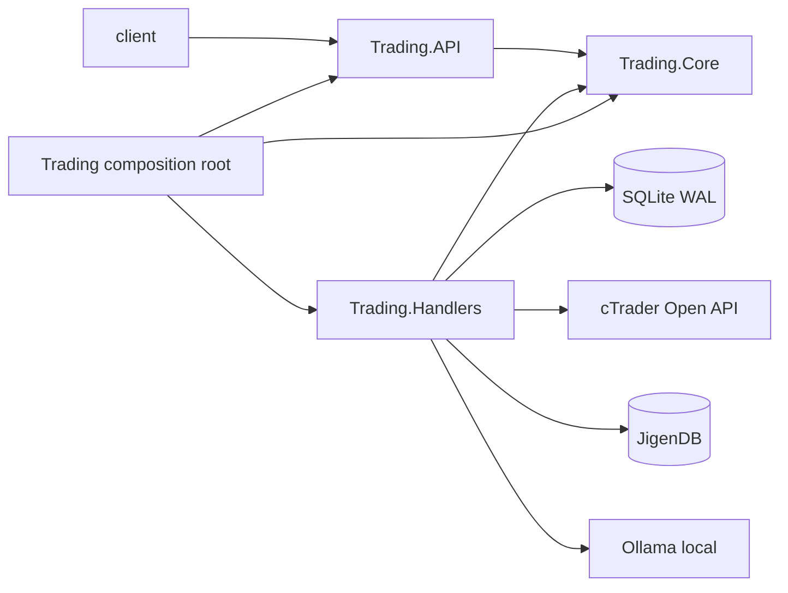

# Analisi tecnica

Status: proposta per Gate 3  
Data: 2026-09-18

## 1. Vincoli architetturali

- `prototipe/` e un riferimento immutabile, non una base di codice.
- `client/` e un nuovo progetto Vue 3 TypeScript.
- `server/` e un nuovo modulo .NET 10 con ASP.NET Core e hosted Worker Services.
- SQLite WAL contiene lo stato transazionale; JigenDB contiene solo memoria semantica.
- Hikyaku applica CQRS: query read-only, comandi con un unico owner di scrittura.
- cTrader e l'autorita finale su ordini, deal e posizioni.
- Risk Engine ed Execution Engine sono deterministici; Ollama non dipende dal gateway ordini.
- Il processo parte fail-closed e abilita gli ordini solo dopo autenticazione e riconciliazione.

## 2. Layout fisico

```text
AutoTrade/
  prototipe/                         # riferimento UX, congelato
  client/                            # nuovo Vue 3 + TypeScript
  server/
    AutoTrade.Trading.Core/          # contratti netstandard2.0
    AutoTrade.Trading.API/           # controller ASP.NET Core net10.0
    AutoTrade.Trading.Handlers/      # handler, EF Core, adapter net10.0
    AutoTrade.Trading/               # composition root + hosted services net10.0
    AutoTrade.Trading.Handlers.Tests/# xUnit
    AutoTrade.Trading.slnx
  docs/
```

Il modulo mantiene i quattro progetti prescritti. Market analysis, riconciliazione e token refresh sono `BackgroundService` registrati nel composition root, non un quinto layer applicativo.

Dipendenze:



`API` non referenzia `Handlers`. La composizione collega Hikyaku, controller, handler e adapter.

## 3. Componenti server

| Componente | Responsabilita | Non puo fare |
| --- | --- | --- |
| Controllers | Bind HTTP, identita operatore, dispatch di un contratto | Regole, EF, orchestrazione |
| Basket handlers | Bozze, versioni, attivazione e archivio | Inviare ordini |
| Market Analysis worker | Pianificare analisi e creare candidate proposal | Autorizzare ordini |
| Market Manager handlers | Applicare modalita e transizioni proposta | Bypassare Risk Engine |
| Risk Engine | Valutare snapshot e produrre gate result | Chiamare LLM o scrivere ordini |
| Execution coordinator | Persist-first, sequenza gambe, compensazione | Assumere atomicita broker |
| cTrader gateway | OAuth, Protobuf, eventi, richieste e rate limit | Decidere rischio |
| Reconciliation worker | Allineare ordini/posizioni/deal broker-locali | Creare retry ciechi |
| JigenDB adapter | Upsert/retrieval di evidenze semantiche | Scrivere stato transazionale |
| Ollama adapter | Chiamata locale e validazione output strutturato | Accedere a cTrader |
| Journal writer | Append atomico degli eventi di dominio/audit | Aggiornare o eliminare eventi |

## 4. CQRS e API

I nomi seguenti sono contratti iniziali. Ogni comando ha un handler; ogni filtro distinto ha una query distinta. Le validazioni di transizione, unicita e rischio sono comandi dedicati read-only richiamati dal write handler.

### 4.1 Sessione e salute

| HTTP | Contratto | Risultato |
| --- | --- | --- |
| `POST /api/session/login` | `LoginOperator` | Sessione cookie |
| `POST /api/session/logout` | `LogoutOperator` | `204` |
| `GET /api/session` | `GetCurrentSession` | Operatore e scadenza |
| `GET /api/operations/status` | `GetOperationalStatus` | Broker, worker, store e kill switch |
| `POST /api/operations/kill-switch/engage` | `EngageKillSwitch` | Command-then-query |
| `POST /api/operations/kill-switch/release` | `ReleaseKillSwitch` | Richiede stato riconciliato |

### 4.2 Panieri

| HTTP | Contratto |
| --- | --- |
| `POST /api/baskets` | `CreateBasket` |
| `GET /api/baskets` | `GetBaskets` |
| `GET /api/baskets/{basketId}` | `GetBasketById` |
| `GET /api/baskets/active` | `GetActiveBasket` |
| `PATCH /api/baskets/{basketId}/identity` | `UpdateBasketIdentity` |
| `PATCH /api/baskets/{basketId}/composition` | `UpdateBasketComposition` |
| `PATCH /api/baskets/{basketId}/policy` | `UpdateBasketPolicy` |
| `POST /api/baskets/{basketId}/clone` | `CloneBasket` |
| `POST /api/baskets/{basketId}/versions` | `PublishBasketVersion` |
| `GET /api/baskets/{basketId}/versions` | `GetBasketVersionsByBasket` |
| `POST /api/baskets/{basketId}/versions/{versionId}/activate` | `ActivateBasketVersion` |
| `POST /api/baskets/{basketId}/archive` | `ArchiveBasket` |

Write ownership: `UpdateBasketIdentity` scrive solo il nome; `UpdateBasketComposition` solo le gambe della bozza; `UpdateBasketPolicy` solo la policy della bozza. Le versioni pubblicate non sono target di update.

### 4.3 Market Manager

| HTTP | Contratto |
| --- | --- |
| `GET /api/market-manager/status` | `GetMarketManagerStatus` |
| `PATCH /api/market-manager/mode` | `UpdateMarketManagerMode` |
| `POST /api/market-manager/analysis/start` | `StartContinuousAnalysis` |
| `POST /api/market-manager/analysis/stop` | `StopContinuousAnalysis` |
| `GET /api/proposals/pending-review` | `GetProposalsPendingReview` |
| `GET /api/proposals/recent` | `GetRecentProposals` |
| `GET /api/proposals/{proposalId}` | `GetProposalById` |
| `POST /api/proposals/{proposalId}/approve` | `ApproveProposal` |
| `POST /api/proposals/{proposalId}/reject` | `RejectProposal` |
| `POST /api/proposals/{proposalId}/suspend` | `SuspendProposal` |

Il worker non chiama controller: pubblica `AnalyzeActiveBasket` tramite Hikyaku. Il relativo handler crea la proposta solo dopo output strutturato valido e snapshot persistito.

### 4.4 Esecuzioni

| HTTP | Contratto |
| --- | --- |
| `GET /api/executions/active` | `GetActiveExecutions` |
| `GET /api/executions/recent` | `GetRecentExecutions` |
| `GET /api/executions/{executionId}` | `GetExecutionById` |
| `POST /api/executions/{executionId}/confirm-shortfall` | `ConfirmExecutionShortfall` |
| `POST /api/executions/{executionId}/compensate` | `RequestExecutionCompensation` |

La creazione dell'esecuzione e interna alla transizione autorizzata della proposta. Non esiste un endpoint che accetti gambe arbitrarie dal client.

### 4.5 Storico e journal

| HTTP | Contratto |
| --- | --- |
| `GET /api/episodes/recent` | `GetRecentEpisodes` |
| `GET /api/episodes/by-outcome/{outcome}` | `GetEpisodesByOutcome` |
| `GET /api/episodes/by-basket/{basketId}` | `GetEpisodesByBasket` |
| `GET /api/episodes/{episodeId}` | `GetEpisodeById` |
| `GET /api/performance/recent` | `GetRecentPerformanceMetrics` |
| `GET /api/performance/by-basket/{basketId}` | `GetPerformanceMetricsByBasket` |
| `GET /api/journal/recent` | `GetRecentJournalEvents` |
| `GET /api/journal/by-correlation/{correlationId}` | `GetJournalEventsByCorrelation` |

Paginazione e finestre temporali sono obbligatorie nei contratti di lista; non selezionano semanticamente query diverse tramite parametri opzionali.

## 5. Modello transazionale proposto

Le chiavi sono `Guid` UUIDv7 creati nel behavior layer. Importi, prezzi e percentuali seguono la convenzione di progetto `double`; volumi broker restano interi nelle unita del protocollo. Tutte le date sono UTC.

| Entita | Dati principali | Vincoli proposti |
| --- | --- | --- |
| `Operator` | Id, UserName, PasswordHash, FailedAttempts, LockedUntilUtc | username univoco; hash, mai password |
| `OperatorSession` | Id, OperatorId, StartedAtUtc, ExpiresAtUtc, EndedAtUtc | session hash univoco; audit append |
| `TradingAccount` | Id, BrokerAccountId, Environment, TradingEnabled | un solo demo attivo nel MVP |
| `BrokerCredential` | AccountId, encrypted tokens, ExpiresAtUtc | cifrato; mai loggato o esposto |
| `Basket` | Id, Name, Status, DraftRevision | nome univoco tra non archiviati |
| `BasketDraftLeg` | Id, BasketId, SymbolId, side, weight, timeframe, risk cap | indice BasketId+SymbolId; range validati |
| `BasketPolicyDraft` | BasketId, risk/daily loss/coverage/failure mode | uno a uno col basket |
| `BasketVersion` | Id, BasketId, Number, snapshot policy, CreatedBy | BasketId+Number univoco; immutabile |
| `BasketVersionLeg` | Id, VersionId, ordinal, snapshot completo | VersionId+ordinal e VersionId+SymbolId univoci |
| `ActiveBasket` | singleton key, BasketVersionId, ActivatedBy/At | una sola riga; transazione di swap |
| `MarketSnapshot` | Id, AccountId, CapturedAt, freshness, content hash | input riproducibile della proposta |
| `Proposal` | Id, VersionId, SnapshotId, action, status, expiry, risk | una esecuzione massima; version token |
| `GateEvaluation` | Id, ProposalId/ExecutionId, code, outcome, observed, threshold | append-only per valutazione |
| `Execution` | Id, ProposalId, status, policy snapshot, coverage, correlation | ProposalId univoco |
| `ExecutionLeg` | Id, ExecutionId, ordinal, clientOrderId, broker IDs, status | clientOrderId univoco; ordinal univoco |
| `BrokerEvent` | Id, account, payload type, broker identity, received at | deduplica per identita/event hash |
| `Episode` | Id, VersionId, ExecutionId, outcome, PnL, R, MAE/MFE | derivato da deal riconciliati |
| `JournalEvent` | Id, sequence, correlation, kind, actor, payload, occurred at | append-only; sequence univoca |
| `WorkerCheckpoint` | WorkerName, cursor, UpdatedAt | un checkpoint per worker |

Lunghezze stringa, precisioni operative, indici finali, nullability e retention devono essere confermati da uno sviluppatore umano prima delle entity EF. Nessuna migration viene generata dall'agente.

SQLite viene configurato con WAL, foreign keys abilitate, busy timeout e transazioni brevi. Un solo processo server e writer autorevole; i worker non mantengono un secondo database context concorrente oltre l'unita di lavoro del singolo handler.

## 6. cTrader gateway

### 6.1 Autenticazione e segreti

Il flusso ufficiale e OAuth 2.0:

1. redirect dell'operatore al consenso cTrader con scope `trading`;
2. callback server con authorization code a vita breve;
3. scambio server-side con access/refresh token;
4. `ProtoOAApplicationAuthReq`;
5. `ProtoOAGetAccountListByAccessTokenReq` e selezione dell'unico demo approvato;
6. `ProtoOAAccountAuthReq`;
7. refresh preventivo e nuova account auth dopo rotazione token.

Client secret, access token e refresh token non entrano nel client Vue. Sono cifrati a riposo con chiave fornita fuori dal database tramite environment protetto o credenziale systemd. Log e journal contengono solo fingerprint non reversibili.

### 6.2 Connessione

Il gateway mantiene una connessione long-lived, heartbeat, backoff esponenziale con jitter e rispetto di `retryAfter`. Gestisce esplicitamente disconnect, token invalidation, maintenance e rate limit. Le sottoscrizioni vengono ricostruite dopo ogni nuova autenticazione.

### 6.3 Idempotenza e correlazione

Prima dell'invio si persiste `ExecutionLeg` con un `clientOrderId` deterministico e lungo al massimo 50 caratteri. Il gateway usa anche il correlation id del protocollo. Un retry e consentito solo quando una query di riconciliazione dimostra che l'ordine non esiste; un timeout da solo non lo dimostra.

`ProtoOAExecutionEvent` e `ProtoOAOrderErrorEvent` aggiornano lo stato tramite comandi Hikyaku idempotenti. Gli eventi duplicati non producono nuove transizioni.

### 6.4 Riconciliazione

- All'avvio e dopo reconnect: `ProtoOAReconcileReq` per posizioni e pending order.
- Storico: `ProtoOAOrderListReq` e `ProtoOADealListReq`, con paginazione `hasMore` e checkpoint UTC.
- Dettaglio dubbio: `ProtoOAOrderDetailsReq` e deal per position/order.
- Divergenze non risolvibili: operativita bloccata, health `Degraded`, evento audit e intervento operatore.

## 7. Risk ed execution consistency

La transazione locale che autorizza l'esecuzione registra proposta, gate finali, esecuzione e prima gamba `Prepared`. L'invio broker avviene dopo commit. Questo evita ordini senza intenzione persistita; il percorso inverso viene recuperato dalla riconciliazione.

Ogni transizione usa optimistic concurrency. Sono illegali:

- due esecuzioni per proposta;
- invio da proposta scaduta, sospesa o bloccata;
- passaggio alla gamba successiva prima dello stato terminale richiesto;
- modifica di snapshot/policy dopo l'avvio;
- riattivazione automatica dopo divergenza broker.

## 8. JigenDB e Ollama

`IJigenEvidenceStore` espone solo upsert di episodi/evidenze e retrieval top-k con metadati. Il riferimento transazionale conserva evidence id, score, modello embedding e query hash, non il vettore.

`IOllamaAnalysisClient` riceve un input versionato e restituisce JSON aderente a uno schema. Timeout, dimensione, modello e temperatura sono configurati. Output non deserializzabile, campi fuori range o simboli non consentiti vengono scartati. Il rationale non puo modificare i valori calcolati dal Risk Engine.

L'API e il pacchetto .NET effettivi di JigenDB devono essere validati con uno spike prima della slice RAG; fino ad allora l'adapter rimane un contratto e non una dipendenza assunta.

## 9. Sicurezza

- ASP.NET Core cookie authentication same-origin, cookie `HttpOnly`, `Secure`, `SameSite=Strict`.
- Protezione antiforgery per ogni comando mutante.
- Password hash tramite API ASP.NET Core, lockout e rotazione credenziali configurabili.
- CORS disabilitato in produzione same-origin; reverse proxy limita l'esposizione alla LAN/VPN approvata.
- Endpoint operativi autorizzati; callback OAuth protetta da state/nonce e redirect URI esatta.
- Segreti fuori da repository, settings pubblici, log e payload client.
- Audit di login, cambio modalita, kill switch, attivazione basket, decisione proposta e promozione live.

Non esistono token in `localStorage`, login di fallback o bypass in caso di indisponibilita del server.

## 10. Client di produzione

Il progetto nasce con TypeScript, Router, Pinia, Vue I18n, Element Plus, Axios e LESS. Mantiene la grammatica visuale validata, ma ricrea componenti e logica usando i contratti REST canonici.

Struttura minima:

```text
client/src/
  @types/              # declare namespace server
  assets/
  components/
  composables/
  lang/
  layouts/
  modules/auth/
  modules/trading/
  router/
  services/
  store/
  settings.ts
```

I service sono transport-only, un metodo per endpoint, senza mapping o normalizzazione. Pinia orchestra stato e refresh; le view gestiscono i workflow; i componenti sono presentazionali. Non viene importato alcun file da `prototipe/`.

Il client usa polling condizionale per stato operativo, proposte ed esecuzioni nel MVP. Eventuali push server-side richiedono una successiva decisione di stack; il flusso corretto non dipende da aggiornamenti realtime del browser.

## 11. Osservabilita e operazioni

- Logging strutturato JSON con `correlationId`, `proposalId`, `executionId` e `clientOrderId`; nessun segreto.
- Health check separati per liveness e readiness.
- Metriche minime: lag dati, durata analisi, proposte per esito gate, ordini per esito, tempo riconciliazione, divergenze, errori/rate limit broker, latenza Ollama/JigenDB.
- Journal funzionale distinto dai log tecnici.
- Clock sincronizzato via NTP e UTC in persistenza/log.
- Backup consistente di SQLite e JigenDB con restore testato; retention configurata.

Deployment singolo host Linux:

- processo .NET gestito da systemd con restart controllato;
- client statico e API dietro reverse proxy TLS;
- Ollama e JigenDB raggiungibili solo localmente;
- directory dati e backup fuori dagli artefatti applicativi;
- graceful shutdown: stop nuove analisi, checkpoint worker, nessuna falsa finalizzazione degli ordini.

## 12. Test

| Livello | Copertura minima |
| --- | --- |
| Unit handler | Happy path, ogni validazione fallita, ownership della scrittura, query read-only |
| Risk Engine | Boundary table per ogni soglia, dato mancante, stale, kill switch, demo/live |
| State machine | Ogni transizione valida e invalida; duplicate event e concurrency |
| Persistence | Vincoli SQLite reali, transazioni, WAL contention, append-only journal |
| cTrader contract | Serializzazione Protobuf, correlation, error mapping, token rotation |
| Broker integration demo | Auth, reconcile, order minimo, fill/error, reconnect senza duplicati |
| Ollama/JigenDB | Schema output, timeout, indisponibilita, evidence linkage |
| API | Auth, antiforgery, status code e command-then-query |
| Client | Store/service contract, route guards, loading/empty/error/degraded states |
| End-to-end demo | Basket -> proposta -> gate -> ordine -> reconcile -> episode -> journal |

## 13. Rischi tecnici

| Rischio | Mitigazione/gate |
| --- | --- |
| Duplicazione ordine su timeout | Persist-first, clientOrderId, reconcile-before-retry |
| SQLite conteso dai worker | Un writer process, transazioni brevi, WAL/load test |
| Semantica RAG non riproducibile | Versionare modello/query e conservare evidence ids |
| Output LLM non valido | JSON schema, allowlist e fail-closed |
| Compensazione incompleta | Stato esplicito, nuova sequenza auditata, intervento operatore |
| Token cTrader revocato/ruotato | Refresh atomico, re-auth, reconcile prima di resume |
| Drift prototipo-produzione | Traceability AC -> test, nessun riuso dei mock |

## 14. Fonti normative e tecniche

- cTrader Open API, app/account authentication: https://help.ctrader.com/open-api/account-authentication/
- cTrader Open API, messages: https://help.ctrader.com/open-api/messages/
- cTrader Open API, error handling: https://help.ctrader.com/open-api/error-handling/
- cTrader Open API, C# SDK: https://help.ctrader.com/open-api/net_SDK/net-sdk-index/

## Appendice A - Risk Engine: gate, soglie e fail-closed

Vincoli già approvati:

- AC-05: nessuna proposta senza versione attiva e snapshot di mercato valido.
- AC-08: ogni gate espone codice, valore osservato, soglia e timestamp; i dati mancanti bloccano l'operazione.
- Il Risk Engine e deterministico: non chiama LLM, non scrive ordini, non decide da solo.
- Il vocabolario di verdetto e quello del prototipo: `approved`, `review`, `blocked`.

Verdetto della decisione: `Block` se almeno un gate blocca, altrimenti `Review` se almeno un gate richiede revisione, altrimenti `Allow`. Un input mancante o non valutabile produce `Block`: non esiste un percorso permissivo in assenza di dato.

| Codice gate | Condizione valutata | Soglia | Fonte della soglia | Se violata |
| --- | --- | --- | --- | --- |
| `RISK_ACTIVE_VERSION_MISSING` | esiste una versione attiva del paniere | - | stato applicativo | Block |
| `RISK_KILL_SWITCH_ENGAGED` | kill switch rilasciato | - | stato applicativo | Block |
| `RISK_SNAPSHOT_MISSING` | snapshot di mercato presente e completo | - | pipeline analisi | Block |
| `RISK_SNAPSHOT_STALE` | eta dello snapshot | `Trading:Risk:SnapshotMaxAgeSeconds` | configurazione, **da decidere** | Block |
| `RISK_COVERAGE_BELOW_MINIMUM` | copertura eseguibile delle gambe selezionate | `MinimumCoverage` (%) | policy del paniere (approvata) | Block o Review secondo `FailurePolicy` |
| `RISK_RISK_PER_BASKET_EXCEEDED` | rischio aggregato del paniere | `RiskPerBasket` (%) | policy del paniere (approvata) | Block |
| `RISK_DAILY_LOSS_EXCEEDED` | perdita giornaliera realizzata piu aperta | `DailyLossLimit` (%) | policy del paniere (approvata) | Block |
| `RISK_LEG_SPREAD_EXCEEDED` | spread per gamba | `Trading:Risk:Markets:{Market}:LegSpreadMaxPips` | configurazione, **da decidere per mercato** | Block sulla gamba |
| `RISK_LEG_VOLATILITY_EXCEEDED` | volatilita per gamba | `Trading:Risk:Markets:{Market}:LegVolatilityMaxPercent` | configurazione, **da decidere per mercato** | Block sulla gamba |
| `RISK_LEG_DATA_MISSING` | dato di mercato per gamba mancante | - | - | Block |

`{Market}` e il valore di `MarketKind` della gamba (`Fx`, `Metal`, `Index`), lo stesso enum persistito su `BasketVersionLeg.Market` e mostrato al momento della composizione: la soglia applicata a una gamba e quella del suo mercato, mai quella di un altro.

Soglie per mercato: le soglie di gamba sono differenziate per mercato (ADR-0013). La finestra di validita dello snapshot resta **globale**, perche una versione porta un solo snapshot: se in futuro lo snapshot diventera per mercato, anche questa soglia lo diventera. In ogni caso il valore osservato e il limite applicato sono riportati su ogni gate, quindi l'operatore vede sempre quale numero e stato usato.

Per ogni mercato del catalogo il Risk Engine richiede **entrambe** le soglie di gamba. Un mercato non configurato, o configurato a meta, non prende in prestito la soglia di un altro mercato: le gambe di quel mercato bloccano con `RISK_THRESHOLD_NOT_CONFIGURED` e il gate porta il mercato a cui si riferisce. `IsFullyConfigured` di `GET /api/risk/limits` e vero solo quando la finestra dello snapshot e tutte le soglie di tutti i mercati del catalogo sono configurate, anche quelli non usati dal paniere attivo.

Traduzione della policy di esecuzione incompleta gia approvata in verdetto:

| `FailurePolicy` | Copertura | Verdetto |
| --- | --- | --- |
| `MinimumCoverage` | sotto `MinimumCoverage` | Block |
| `AllOrNothing` | sotto 100% | Block |
| `RequireConfirmation` | almeno `MinimumCoverage` ma sotto 100% | Review |
| qualsiasi | 100% | nessuna violazione |

Soglie non ancora decise: finche `Trading:Risk:SnapshotMaxAgeSeconds` e le soglie di gamba dei mercati non sono configurate, i rispettivi gate bloccano. Non esistono valori predefiniti nel codice: un default silenzioso sarebbe una decisione di rischio presa dall'implementazione invece che dall'operatore.
- .NET support policy: https://dotnet.microsoft.com/platform/support/policy
- SQLite WAL: https://sqlite.org/wal.html
